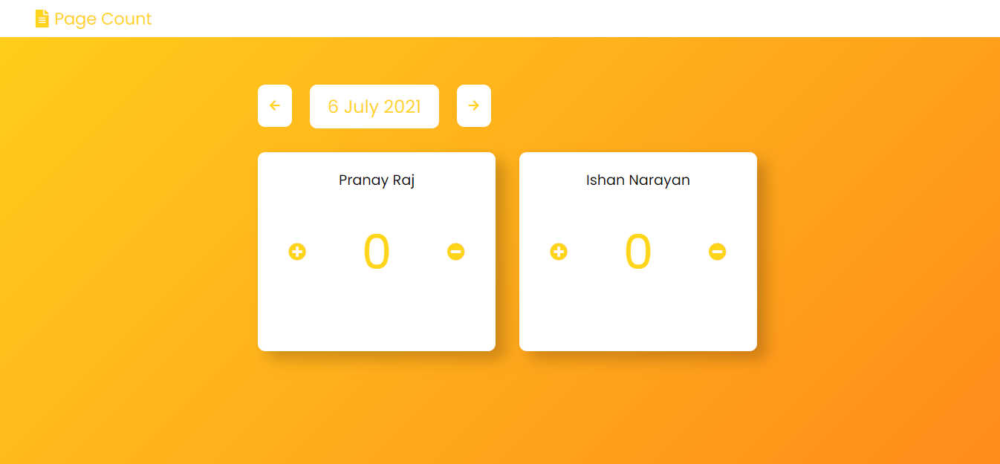
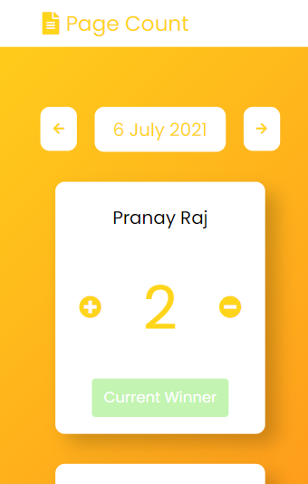
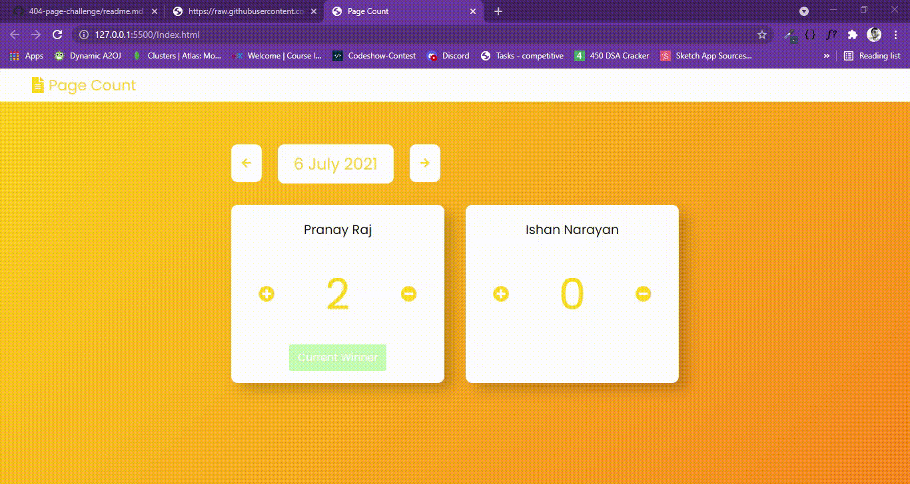

# Page Count 

## Productive Counter Application 🌟

This is advanced and productive counter application.
Click Here [Live Link](https://masterpranay1.github.io/Page-Count/Index.html)

{ FIREBASE STORING FUNCTIONS MIGHT NOT WORK because i was exploring the firebase so i used firebase with no authentication which is expire after 30 days. }

- [Overview](#overview)
- [Screenshots](#screenshots)
- [Built With](#built-with)
- [Features](#features)
- [My Learning](#my-learnings)
- [Future Improvement](#future-improvement)
- [Author](#author)

## Overview

I and Ishan(my friend) plan to compete max-page competetion for Our Upcoming IIT-JEE examinataion.
So I decided to make this application which keep records of no of page done in a day.

## Screenshots

#### Desktop

#### Mobile

#### Animations

## Built With

- Html5
- Css3
- JavaScript
- FireBase (FireStore)

## Features

- Responsive
- Clean UI
- Clean Code 🧼
- Data storing to firestore
- Keep history of Different Dates

## My Learnings

1. FireBase
2. JavaScript DateTime
3. Css Grid

## Future Improvement

- <b>Authentication</b> :- Users should only be able to increase or decrease their page count
- <b>Statics</b> :- A separate panel for displaying data in charts and graph
- <b>UX</b> There are UX issue which can be improved

## Author

    Hey!! I am Pranay Raj. I love making cool projects and contributing to open source.
    Feel Free to create a issue or to contribute to this project. 💘
